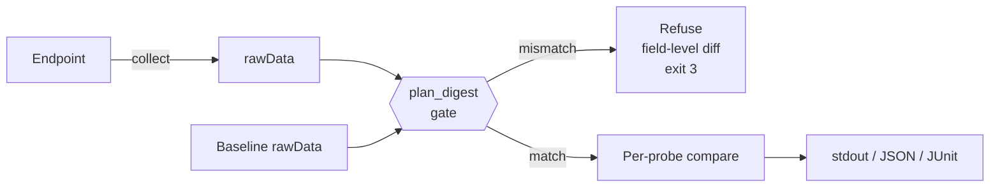
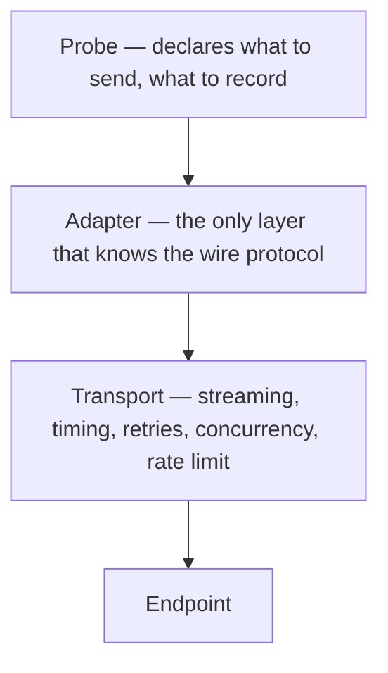

<div align="center">

# Token Verifier

**A stateless CLI for verifying whether an LLM API endpoint serves the model and configuration it claims**

English / <a href="./README_zh.md">中文</a>

[](LICENSE)
[](https://go.dev)
[](https://github.com/chaterm/Token-Verifier/actions/workflows/ci.yml)
[](#project-status)

</div>

---

Token Verifier is a single static binary that answers one question: **is this endpoint serving the model it says it is?** It is built for model vendors, API aggregators, proxy services and self-hosted inference endpoints, and it is designed to drop into a CI pipeline or a monitoring loop with no server, no database and no UI.

It works by splitting verification into two independent steps. **Collect** sends a fixed test plan to an endpoint and writes the observations into a self-contained evidence file — the rawData. **Compare** reads two rawData files and reports a verdict per probe, making no network requests at all.

That split means the official baseline and a user's own measurement travel the exact same code path: publishing a reference rawData for a model uses the same `collect` command any user runs.

> [!IMPORTANT]
> Token Verifier verifies **LLM API fidelity**. It is not a JWT, OAuth, or access-token validation library.

## Why Token Verifier?

The same model name does not always mean the same service. An endpoint may:

- route requests to a different or smaller model;
- use aggressive quantization or altered inference parameters;
- truncate prompts, reasoning traces, or generated content;
- report inaccurate token usage;
- silently disable or reduce a reasoning budget you asked for;
- claim unsupported context lengths or API features;
- behave differently across protocols, or between streaming and non-streaming;
- become unreliable under concurrency or long-running requests.

Token Verifier turns these concerns into reproducible measurements and comparable evidence files.

## What It Verifies

Five probes, each producing one statistic and one verdict:

| Probe | What it observes | Statistic |
| :--- | :--- | :--- |
| **`onetoken`** | The value distribution of very short answers, sampled at temperature 1.0 | Jensen–Shannon divergence between distributions |
| **`tokenizer`** | Server-reported input token counts on tokenizer-sensitive inputs | Per-item integer equality → contingency chi-square |
| **`needle`** | Recall of deterministically derived markers buried at declared positions in long context (one needle = one statistical unit) | Per-needle-unit hit counts → 2×2 chi-square |
| **`think-effort`** | Reasoning-amount distribution at a declared effort level (tokens, or thinking-text chars where the protocol reports no reasoning-token field) | Per-cell (effort × protocol) Mann-Whitney U → Fisher-combined p-value |
| **`toolcall`** | Tool selection, syntactic argument validity, parallel calls | Selection-distribution JSD + pooled validity-rate chi-square (worst component decides) |

Alongside every request, the coordinator records availability, error rate, timeout rate, TTFT, TPS and end-to-end latency. These are reported as **descriptive** comparisons and do not affect pass/fail unless you explicitly supply a threshold for them — they mostly reflect the network path and momentary load, not model identity, and scoring them produces false positives across regions and time windows.

Protocol compatibility is **declared in configuration, not probed**: you state which protocols the endpoint speaks and what each supports (streaming, tools, reasoning). The tool trusts that declaration and does not spend requests discovering capabilities. When reality disagrees — a request fails because a capability is missing — the affected probe/protocol combination is skipped and the reason is recorded in the rawData. "One side supports tool calls and the other does not" is itself evidence, and the skip records make it visible.

## Design Principles

| Principle | What it means |
| :--- | :--- |
| **Evidence over claims** | Every verdict links back to per-cell observations retained in the rawData |
| **Stateless** | No database, no server, no persisted state. Two files in, one verdict out |
| **Refuse rather than compare loosely** | If the two sides were not collected under the same plan, the tool refuses and shows the conflicting fields. A verdict carrying a footnote that says "not entirely comparable" gets consumed as a normal result in CI, and nobody reads the footnote |
| **Thresholds belong to the operator** | No default thresholds are shipped. What counts as a meaningful difference depends on the model, the deployment and your tolerance; a plausible-looking default would make that judgement for you without you knowing |
| **Provider-neutral** | Compare official APIs, third-party vendors, gateways and self-hosted endpoints with the same plan |
| **Pluggable probes** | A probe declares what to send and what to record. It never issues requests itself, so timing and concurrency have exactly one implementation |
| **Safe by default** | Credentials never reach disk — only an 8-character key fingerprint. rawData has two redaction levels, and the publishable one carries no model output text |
| **Automation-friendly** | Stable exit codes, machine-readable JSON and JUnit output |

## How It Works



Four layers, with one rule holding them apart: **a probe may not issue its own requests.**



Because transport is shared, TTFT means the same thing for every probe, and no probe can quietly redefine it by implementing HTTP itself.

Full design: [PROBES.md](./docs/PROBES.md) (why each probe works) · [ARCHITECTURE.md](./docs/ARCHITECTURE.md) · [DATAFLOW.md](./docs/DATAFLOW.md) · [SPEC-CONFIG.md](./docs/SPEC-CONFIG.md) · [SPEC-SUITE.md](./docs/SPEC-SUITE.md) · [SPEC-RAWDATA.md](./docs/SPEC-RAWDATA.md)

## rawData

rawData is the central artifact: the only output of collection, the only input to comparison, and the form in which reference baselines are published.

A single gzipped NDJSON file, `<name>.rawdata.jsonl.gz`, in three parts:

```
line 1        {"kind": "manifest",   ...}   collection plan + plan_digest + declared capabilities
lines 2..N    {"kind": "record",     ...}   one per request attempt
last line     {"kind": "aggregates", ...}   per-cell summaries + layered transport metrics
```

One file is easy to attach to a release; gzip compresses repetitive JSON well; and because it is append-only, **the file is its own resume state** — no separate checkpoint is needed.

The manifest carries the full **collection plan** and its SHA-256 digest. The plan contains only the *experiment design* — what data gets collected, independent of which gateway it is sent through: suite version, question set, repeats, sampling parameters, context buckets, per-probe `min_n`, padding seed, and normalization rules. It deliberately excludes the whole `target` section (base URL, API key, capabilities, the protocol's `thinking` wiring, field-injection routes), plus concurrency, timeouts and **thresholds** — thresholds are a judgement applied at comparison time, not a collection parameter, which is exactly why you can tune them freely without losing comparability against an official baseline. The digest locks the experiment, not the gateway plumbing: which thinking level each question exercises travels with the suite (question-level `thinking_effort`); each protocol's `effort_map` is merely how that level is spelled on that particular gateway.

It also excludes the protocol/transport mix. That mix is your own test lever: mix formats if you want to check that the model behaves the same across them, use a single format if you do not. Locking it into the digest would take that lever away — an official baseline published with one format would make every mixed-format collection instantly incomparable. The resolved allocation is still recorded in the manifest (as `sampling`) for reproducibility and attribution, and a comparison whose two sides mixed differently prints a NOTE — not a refusal — so you can tell a format-related discrepancy apart from a model one. This rests on one stated premise: **the request format does not change the model's fingerprint.** If that premise ever fails, it fails legibly — a mixed-format collection disagrees with the official fingerprint while a single-format one matches, which is exactly how you would localize the problem to the format.

Two redaction levels. `digest` keeps observations plus content hashes and is the default for publishing; `full` additionally keeps raw response text for local audit (`full` is not implemented yet — configuring it is rejected rather than silently downgraded). All comparison statistics must be computable from `digest` alone — which is why matching and normalization happen at collection time, inside the probe's `Observe` step, rather than being deferred to comparison.

## Project Status

> [!NOTE]
> The **comparison and collection paths are implemented** for all five probes. `tv collect` reads a config + suite, builds the collection plan and its digest, allocates requests proportionally across protocols and transport modes, probes the endpoint through the `openai-chat`, `anthropic-messages` and `openai-responses` adapters (streaming and non-streaming, with retries and timing), and writes resumable rawData. `tv run` chains collect + compare against a baseline in one command. `tv compare` runs the offline digest gate and reports per-probe verdicts for `onetoken`, `tokenizer`, `needle`, `think-effort` and `toolcall` (stdout / JSON / JUnit). Still to come: congestion control. The documents under `docs/` remain the design of record.

## Installation

Prebuilt binaries — Linux / macOS / Windows on amd64 and arm64, each archive bundling the example config and suite so you can `--dry-run` right after unpacking:

```bash
# from the latest release
curl -LO https://github.com/chaterm/Token-Verifier/releases/latest/download/tv-linux-amd64.tar.gz
tar xzf tv-linux-amd64.tar.gz && ./tv --help

# or, with a Go toolchain
go install github.com/chaterm/token-verifier/cmd/tv@latest
```

In CI, the stable download URL keeps pipelines simple:

```yaml
- run: curl -LO https://github.com/chaterm/Token-Verifier/releases/latest/download/tv-linux-amd64.tar.gz
- run: tar xzf tv-linux-amd64.tar.gz
- run: ./tv run -c token-verifier.yaml baseline.rawdata.jsonl.gz --junit report.xml
```

Exit codes are CI-friendly: `0` all probes pass, `1` at least one fail, `3` the two sides are not comparable (a configuration problem, not a measurement), `5` inconclusive, `6` subset comparison (`--allow-subset`) — never silently consumed as a "pass". See [CI integration](#use-cases).

## Quick Start

**1. Write a configuration file**

```yaml
# token-verifier.yaml
version: 1

target:
  base_url: https://api.example.com
  api_key_env: TARGET_API_KEY
  model: example-model

  protocols:
    - id: openai-chat
      weight: 0.7
      capabilities: { stream: true, tools: true, thinking: true, context_window: 131072 }
      transport: { stream: 0.5, non_stream: 0.5 }
      thinking:
        disabled:
          body_overrides: {}
        enabled:
          effort_map: { low: low, medium: medium, high: high }
          body_overrides:
            reasoning_effort: "${thinking_effort}"

    - id: anthropic-messages
      weight: 0.3
      capabilities: { stream: true, tools: true, thinking: true, context_window: 200000 }
      transport: { stream: 1.0, non_stream: 0.0 }
      thinking:
        disabled:
          body_overrides: {}
        enabled:
          effort_map: { low: 1024, medium: 4096, high: 16384 }
          body_overrides:
            thinking:
              type: enabled
              budget_tokens: "${thinking_effort}"

suite:
  path: ./suite.yaml           # the question bank; an external file, see SPEC-SUITE.md
  sha256: ...                  # optional integrity check

probes:
  onetoken:
    enabled: true
    repeats: 20
    temperature: 1.0
    context_buckets: [0, 32000]
    min_n: 10          # optional (default 10): per-side sample floor; enters the digest
  tokenizer:
    enabled: true
    repeats: 1
    context_buckets: [0]
  needle:
    enabled: true
    repeats: 5
    context_buckets: [32000, 128000]

thresholds:            # required for compare/run — no defaults are shipped
  onetoken: 0.15       # per-bucket override, e.g. onetoken.32000: 0.2 (bucket must be in context_buckets)
  tokenizer: 0.01
  needle: 0.01

runtime:               # none of these enter the digest
  max_concurrency: 4
  max_attempts: 3      # per question; each attempt is its own record
  backoff_base_ms: 500 # retry backoff: wait base << n ms, capped by backoff_max_ms
  backoff_max_ms: 30000
  raw_level: digest

padding:
  seed: 12345          # optional (default 12345); padding text = f(bucket, seed), enters the digest
```

A fully commented, ready-to-run example ships at [`config.example.yaml`](./config.example.yaml).

> API keys are read from environment variables (`api_key_env`) and never written to the configuration file or the rawData. Only an 8-character fingerprint of the key is recorded, so that a key change is detectable without exposing the key.

Protocol, transport mode and thinking configuration are **test configuration axes, not probes**. Weights *divide* `repeats` rather than multiplying it: `repeats: 20` split 0.7 / 0.3 means 14 + 6 requests, still 20 in total. Mixing therefore never inflates your budget. The mix itself is not part of the collection plan digest — it is your own test lever, recorded in the manifest but free to differ between the two sides of a comparison (see [rawData](#rawdata)).

The tool does not hard-code any vendor's thinking field names. A question declares a **symbolic** effort level (`low` / `medium` / `high`), each protocol maps that symbol to its own value via `effort_map`, and `body_overrides` places it using the `${thinking_effort}` placeholder. When a field's value is exactly the placeholder, the mapped value replaces it **preserving its JSON type** — an integer stays an integer. Adding a protocol is a config change, not a code change.

> The vendor field names above are **illustrative structure only**. Check them against the current documentation for the endpoint you are targeting; keeping them in configuration rather than in code is precisely because they are a moving target.

The question bank (the *suite*) is **an external YAML file, not something baked into the binary** — you point `suite.path` at it (see [SPEC-SUITE.md](./docs/SPEC-SUITE.md)). The suite also carries the **normalization space**: mechanism rules (`number` / `letter` / `word` / `none`) are code, but vocabulary rules (like `color`) are word tables defined in the suite's `normalize.maps` section, so what counts as "the same answer" is the question-set author's call — reviewable, customizable, and folded into `plan_digest` (changing a word table makes old rawData incomparable by construction). Official reference rawData is published together with the suite file it was collected with, so baselines stay mutually comparable and anyone can reproduce them. Write your own suite when you want to test with your real tool set or prompts you know are sensitive for your models; its conclusions then hold only against data collected with the same suite, and the digest gate enforces that.

**2. Collect a rawData file**

```bash
tv collect -c token-verifier.yaml -o candidate.rawdata.jsonl.gz
```

Add `--dry-run` first to print the request count and a token estimate without spending anything. A minimal example suite (`suites/v1.example.yaml`) ships with the repo and is bundled in every release archive; point `suite.path` at it or copy it as a template. For serious comparisons, use the official suite and baseline of the model you are testing (see below).

**3. Compare against a baseline**

A baseline can be your own earlier collection, or an **official baseline** — a suite snapshot, the collection config, and digest-level rawData published as a set on GitHub Releases of the data repo [`chaterm/Token-Verifier-Data`](https://github.com/chaterm/Token-Verifier-Data) (see [BASELINES.md](./docs/BASELINES.md) and that repo's README for the index). Downloading a baseline release gives you everything needed to compare; the published config already has `suite.path` rewritten to its sibling file and `suite.sha256` filled in, so the three files just work side by side:

```bash
curl -LO https://github.com/chaterm/Token-Verifier-Data/releases/download/baseline-<model>-suitev<N>/suite.yaml
curl -LO https://github.com/chaterm/Token-Verifier-Data/releases/download/baseline-<model>-suitev<N>/official.rawdata.jsonl.gz
curl -LO https://github.com/chaterm/Token-Verifier-Data/releases/download/baseline-<model>-suitev<N>/config.yaml
tv compare official.rawdata.jsonl.gz candidate.rawdata.jsonl.gz
```

Or with your own baseline collected earlier:

```bash
tv compare official-model.rawdata.jsonl.gz candidate.rawdata.jsonl.gz
```

**4. Or collect and compare in one step**

```bash
tv run -c token-verifier.yaml \
  official-model.rawdata.jsonl.gz \
  --json report.json \
  --junit report.xml
```

The baseline is the positional argument. `run` collects into a temporary rawData file and deletes it after comparing; pass `--keep-rawdata` to keep it.

All subcommands accept `--log-level debug|info|warn|error` (default `info`): `debug` prints one line per request during collection (probe, question, protocol, status, latency), which is handy when diagnosing endpoint issues. Logs always go to stderr, so the report on stdout stays clean.

`compare` and `run` also accept `-v` / `--verbose`: it appends an evidence section after the verdict table, rendering per-cell side-by-side ASCII histograms (onetoken answer values, toolcall tool choice, think-effort reasoning-size distribution, tokenizer match details with both sides' observed token counts, needle per-cell recall) plus latency/ttft/tps distribution comparisons on shared bin edges. The verdicts themselves are unchanged — verbose only shows *why*. The `--json` report always carries the underlying data regardless of `-v` (`a_dist`/`b_dist` per cell, `hist` for continuous probes, top-level `transport_histograms`), so plots can be reconstructed downstream.

`run` is exactly `collect` followed by `compare` — the same code path, not a second implementation. **The CLI accepts at most one live endpoint.** To compare two live endpoints, run `collect` twice and then `compare`. That is what makes publishing an official baseline and building your own identical operations.

## Report Example

There is no aggregate score. The report is per-probe evidence and a verdict.

```
plan_digest  sha256:9f2c1a…   (match)
coverage     3/3 probes compared

PROBE              STATISTIC   THRESHOLD  SOURCE   VERDICT
onetoken           0.041 JSD   0.15       config   PASS
tokenizer          p=0.83      α=0.01     config   PASS
needle             p=0.004     α=0.01     flag     FAIL
  ├─ bucket 32000  p=0.62      α=0.01     flag     PASS
  └─ bucket 128000 p=0.004     α=0.01     flag     FAIL

transport (descriptive, not scored)
  availability  0.998 vs 0.994
  ttft_ms p50   290 vs 610
  tps    p50    45.1 vs 22.7

exit 1
```

Multi-bucket probes are judged per `context_bucket` (each bucket against its own threshold — `thresholds.needle.128000` overrides the probe-level value), and the probe row shows the worst bucket. Single-bucket probes render exactly one row, as before.

With `-v`, an evidence section follows — here the `needle` failure shows per-cell recall, and onetoken shows the actual answer distributions behind the JSD:

```
════ evidence detail ════

── onetoken  PASS  statistic 0.041 JSD  threshold 0.15 (config)
   cell context_bucket=0 question_id=ot.v1.001  n 20 vs 20  stat 0.041
     value      A                            B
     3          A ████████████           3   B ████████████████       4
     5          A ████████               2   B                        0
     7          A ████████████████████   5   B ████████████████       4
     9          A                        0   B ████████               2

── needle  FAIL  statistic p=0.004  threshold α=0.01 (flag)
   cell context_bucket=128000 question_id=nd.v1.002  n 40 vs 40  stat -
     recall: A 38/40 (0.95)  B 12/40 (0.3)

── transport distributions (descriptive, not scored)
   latency_ms
     [180,395) A ████████████████████ 512   B ████                  96
     [395,610) A ██                    41   B ████████████████████ 488
```

```json
{
  "plan_digest": "sha256:9f2c1a…",
  "coverage": 1.0,
  "probes": [
    {
      "probe_id": "needle",
      "statistic": 0.004,
      "threshold": 0.01,
      "threshold_source": "flag",
      "ratio": 2.5,
      "verdict": "fail",
      "cells": [
        { "question_id": "nd.v1.002", "context_bucket": 128000,
          "a": { "matched": 38, "n": 40 }, "b": { "matched": 12, "n": 40 } }
      ]
    }
  ]
}
```

Each verdict carries `ratio` — the observed value over the threshold, defined so that `ratio > 1` is always equivalent to a failure regardless of whether the statistic is a distance or a p-value. Nothing consumes it today; it exists so that an aggregate score can be layered on later without re-collecting anything.

**Exit codes**

| Code | Meaning |
| :--- | :--- |
| `0` | All probes passed |
| `1` | At least one probe failed |
| `2` | Usage error, invalid configuration, or a missing threshold |
| `3` | Collection plans are incompatible — comparison refused |
| `4` | Fatal error during collection |
| `5` | No failure, but at least one probe was inconclusive (skipped for a missing capability, or all its cells had insufficient samples) |
| `6` | Subset comparison (`--allow-subset`): no failure and nothing inconclusive, but the verdicts only cover the reconciled intersection of the two plans — not a full pass |

`3` is deliberately distinct from `1`: in CI, "we measured a difference" and "these cannot be compared at all" need different handling. The first should alert; the second should fix a configuration. `5` follows the same reasoning against `0`: an incomplete verdict must not be consumed as "all passed" — exactly the unread-footnote failure mode this tool refuses elsewhere. `6` follows it once more: a subset comparison's "all pass" covers only the intersection, and a shrunken scope must not slip into CI wearing exit 0. A failure outranks inconclusive: if any probe failed, the exit code is `1`.

When plans differ, the tool refuses and shows exactly where:

```
ERROR  incompatible collection plans
  plan_digest  sha256:9f2c1a…  vs  sha256:41ab7e…

  probe onetoken
    repeats                            20        vs  30
    temperature                       1.0        vs  0.7
  probe needle
    context_buckets            [0, 131072]       vs  [0, 262144]

2 probes conflict. Both sides must use the same collection plan;
this tool does not perform partial comparisons.
Add --allow-subset to compare only the reconciled intersection of the two plans.
```

Note what does **not** appear in the diff: the protocol/transport mix. If one side sampled 70/30 across two protocols and the other used a single protocol, the comparison still proceeds — the mix is your test lever, not part of the plan (see [rawData](#rawdata)).

**Subset comparison (`--allow-subset`)**

By default the gate demands byte-identical plans. `tv compare --allow-subset` (same flag on `tv run`) relaxes it to a field-level trichotomy: sampling and identity fields (`temperature`, `top_p`, `max_tokens`, `thinking_effort`, `probe_version`, `observation_schema`, `normalize_rule`, `cell_key`, plus the whole plan level — suite, padding, normalization) must still match exactly or the comparison is refused; `context_buckets` is intersected (buckets only one side declared are dropped and listed); `repeats` takes the smaller value and each cell is downsampled to `min(nA, nB)` by `repeat_index`, so calibrated JSD thresholds keep holding; `min_n` is ignored by the gate (it is a verdict parameter like `thresholds`, consumed only at compare time) and resolves as `local config > value baked into the plan > default`. The probe set itself is intersected — disabled probes never enter a plan, so "present on both sides" is exactly "enabled on both sides".

The shrunken scope is impossible to miss: stdout prints a `SCOPE` section as the very first block (both digests, participating probes with effective repeats/min_n, every excluded probe/bucket and why), the JSON report carries `"subset": true` plus a `scope` object, JUnit carries the same as properties, and an all-pass subset run exits `6`, never `0`.

## What It Does Not Do

| Not in scope | Why |
| :--- | :--- |
| Capability benchmarking (reasoning / coding / multilingual / multimodal scores) | That is a benchmark. It answers "how good is this model", not "is this the same model" |
| An aggregate purity score | Not at this stage. Compressing N probes into one number needs calibration data to justify the weights and the curve; single-run rawData does not contain it. The `ratio` seam is reserved for when it does |
| Default thresholds | Shipping a plausible-looking default would make a judgement on your behalf that you do not know is being made |
| Storage, a server, a web UI or a TUI | Stateless CLI. Output is stdout, JSON and JUnit |
| Proving the true underlying model | Black-box observation yields difference evidence, not identity proof |

## Use Cases

- Verify an AI proxy or reseller before purchasing credits;
- continuously monitor upstream providers behind an AI gateway;
- detect model substitution, capability degradation or configuration drift;
- compare official, third-party and self-hosted endpoints;
- gate a deployment in CI on a per-probe verdict;
- publish reproducible reference rawData for a model release.

## Responsible Testing

Only test endpoints that you are authorized to access. Respect provider terms, rate limits, privacy requirements and applicable laws. Do not publish secrets, private prompts, raw reasoning content, or conclusions that cannot be supported by reproducible evidence.

The `digest` redaction level exists for this: it retains observations and content hashes but no model output text, so a rawData file can be published without leaking responses. Long-context markers are derived from question IDs by hash and never appear in plaintext in either the suite or the rawData, so publishing evidence does not let a tested endpoint anticipate them.

Token Verifier aims to identify observable differences and anomalies. It does not claim to prove the exact underlying model from black-box responses alone.

## Roadmap

- [x] Configuration, validation and proportional allocation
- [x] Collection plan and digest computation
- [x] rawData reader/writer with resume support
- [x] Transport: streaming, TTFT/TPS timing, retries, rate limiting
- [x] Adapter: OpenAI Chat
- [x] Adapter: OpenAI Responses
- [x] Adapter: Anthropic Messages
- [x] Probe: `onetoken`
- [x] Probe: `tokenizer`
- [x] Probe: `needle`
- [x] Probe: `think-effort`
- [x] Probe: `toolcall`
- [x] Digest gate and field-level conflict diff
- [x] Reporters: stdout, JSON, JUnit
- [ ] Published reference rawData for common models

Deferred until calibration data exists: aggregate scoring, threshold derivation from observed variance.

## Contributing

Contributions are welcome, especially reproducible test cases for provider inconsistencies, adapters for additional protocols, and reviews of the statistical methodology.

Before submitting a new probe, document what it observes, its sampling parameters, the minimum sample size per cell, its `Observation` schema, and its known limitations. Any change to what a probe records from a given response must increment its `probe_version` — that is what makes older rawData automatically incomparable instead of silently mismatched.

## Inspiration & Credits

The `onetoken` probe builds on the idea that a model's answer distribution to trivial one-word prompts is a distinctive behavioral fingerprint:

- **One Token Is Enough: Fingerprinting and Verifying Large Language Models from Single-Token Output Distributions** — Tomas Bruckner, *arXiv:2607.10252* [cs.CR], 2026. <https://doi.org/10.48550/arXiv.2607.10252>

The `needle` probe follows the long-context retrieval testing methodology:

- [gkamradt/needle-in-a-haystack](https://github.com/gkamradt/needle-in-a-haystack) — doing simple retrieval from LLM models at various context lengths to measure accuracy.

Also inspired by [MoonshotAI/Kimi-Vendor-Verifier](https://github.com/MoonshotAI/Kimi-Vendor-Verifier) and the broader open-source LLM evaluation ecosystem. The goal is to provide a model-agnostic, provider-neutral verification tool.

## License

Released under the [MIT License](LICENSE).

## Friends

- [linux.do](https://linux.do)
