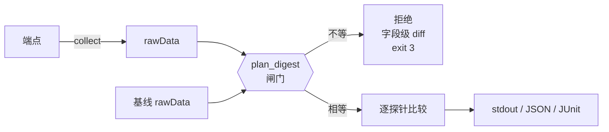
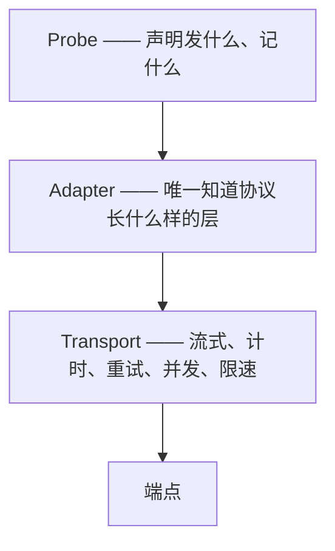

<div align="center">

# Token Verifier

**用于验证大模型 API 端点是否真的提供了它所声称的模型与配置的无状态命令行工具**

中文 / <a href="./README.md">English</a>

[](LICENSE)
[](https://go.dev)
[](https://github.com/chaterm/Token-Verifier/actions/workflows/ci.yml)
[](#项目状态)

</div>

---

Token Verifier 是一个单静态二进制，只回答一个问题：**这个端点提供的是它声称的那个模型吗？** 面向大模型官方服务商、API 聚合平台、第三方中转站和自建推理服务，设计目标是能直接嵌进 CI 流水线或监控循环 —— 不需要服务端、不需要数据库、没有界面。

它把验证拆成两件互不依赖的事。**采集（collect）**按一份确定的测试计划访问端点，把观测结果写成一个自包含的证据文件，即 rawData。**比较（compare）**读两个 rawData 文件，逐探针给出判定，全程不发任何网络请求。

拆开的直接结果是：官方基线与用户自己的实测走完全相同的代码路径 —— 官方发布某模型的参考 rawData，用的就是用户手里那条 `collect` 命令。

> [!IMPORTANT]
> Token Verifier 验证的是**大模型 API 一致性**，不是 JWT、OAuth 或访问令牌的校验库。

## 为什么需要 Token Verifier？

相同的模型名称并不代表相同的服务。一个端点可能：

- 把请求路由到另一个模型或更小的模型；
- 使用激进的量化方案或被改动过的推理参数；
- 截断提示词、思考过程或生成内容；
- 上报不准确的 Token 用量；
- 静默关闭或削减你要求的思考预算；
- 声明并不支持的上下文长度或 API 特性；
- 在不同协议之间、或流式与非流式之间表现不一致；
- 在高并发或长时请求下变得不稳定。

Token Verifier 把这些疑虑转化为可重复的测量和可比较的证据文件。

## 验证内容

五个探针，每个产出一个统计量和一个判定：

| 探针 | 观测什么 | 统计量 |
| :--- | :--- | :--- |
| **`onetoken`** | 温度 1.0 下极短答案的取值分布 | 分布间 Jensen–Shannon 散度 |
| **`tokenizer`** | 分词器敏感输入上服务端上报的输入 token 数 | 逐题整数相等性 → 列联表卡方 |
| **`needle`** | 长上下文中按题目声明位置埋入的确定性派生标记的召回（一个埋点 = 一个统计单元） | 埋点粒度命中数 → 2×2 卡方 |
| **`think-effort`** | 指定思考强度下的思考量分布（token 数；协议无思考 token 字段时用思考文本字数） | 逐 cell（强度 × 协议）Mann-Whitney U → Fisher 合并 p 值 |
| **`toolcall`** | 工具选择、参数语法合法性、并行调用 | 选择分布 JSD + 池化合法率卡方（取更差分量判定） |

伴随每个请求，协调器还会记录可用性、错误率、超时率、首字延迟（TTFT）、TPS 与整体延迟。这些指标以**描述性对比**的形式输出，除非你显式为它们提供阈值，否则**不参与 pass/fail** —— 它们主要反映网络路径与瞬时负载而非模型身份，把它们算进判定会在跨地域、跨时段比较时制造大量假阳性。

协议兼容性**由配置声明，不做探测**：你声明端点支持哪些协议、每个协议支持什么（流式、工具、思考）。工具信任这份声明，不花请求去发现能力。当现实与声明不符 —— 请求因缺能力而失败 —— 受影响的探针/协议组合被跳过，原因记录进 rawData。「一侧支持工具调用、另一侧不支持」这件事本身就是证据，而跳过记录让它可见。

## 设计原则

| 原则 | 含义 |
| :--- | :--- |
| **证据优先于声明** | 每个判定都能追溯到 rawData 中保留的逐 cell 观测 |
| **无状态** | 无数据库、无服务端、无持久状态。两个文件进，一个判定出 |
| **宁可拒绝，不做勉强的比较** | 两侧不是在同一份采集计划下采的，就拒绝执行并指出冲突字段。一个带着「其实有几项不太可比」脚注的判定，在 CI 里会被当成正常结论消费掉，而脚注不会有人读 |
| **阈值属于使用者** | 不提供任何默认阈值。多大的差异算异常，取决于模型本身、部署环境与你的容忍度；给一个看起来合理的默认值，等于替使用者做了一个他不知道自己在做的判断 |
| **服务商中立** | 用同一份计划对比官方 API、第三方厂商、网关和自建端点 |
| **探针可插拔** | 探针只声明发什么、记什么，绝不自己发请求，所以计时与并发只有一份实现 |
| **默认安全** | 密钥永不落盘，只记录 8 位指纹。rawData 有两档脱敏，可发布的那一档不含任何模型输出文本 |
| **易于自动化** | 稳定的退出码，机器可读的 JSON 与 JUnit 输出 |

## 工作原理



四层，只靠一条规则撑开：**探针不许自己发请求。**



因为传输层是共享的，TTFT 对所有探针含义必然相同；反过来，任何探针都无法通过自己实现一遍 HTTP 来悄悄改变它的定义。

完整设计：[PROBES.md](./docs/PROBES.md)（各探针的机理） · [ARCHITECTURE.md](./docs/ARCHITECTURE.md) · [DATAFLOW.md](./docs/DATAFLOW.md) · [SPEC-CONFIG.md](./docs/SPEC-CONFIG.md) · [SPEC-SUITE.md](./docs/SPEC-SUITE.md) · [SPEC-RAWDATA.md](./docs/SPEC-RAWDATA.md)

## rawData

rawData 是这个工具的中心工件：采集阶段的唯一产物、比较阶段的唯一输入，也是官方参考基线的发布形式。

单个 gzip 压缩的 NDJSON 文件 `<name>.rawdata.jsonl.gz`，三段式：

```
第 1 行      {"kind": "manifest",   ...}   采集计划 + plan_digest + 声明的能力
第 2..N 行   {"kind": "record",     ...}   每次请求尝试一条
最后一行     {"kind": "aggregates", ...}   逐 cell 汇总 + 分层传输指标
```

单文件便于作为 release 资产分发；gzip 对高度重复的 JSON 压缩比很好；而且因为是追加写，**文件本身就是续跑状态** —— 不需要额外的检查点文件。

manifest 里带着完整的**采集计划**及其 SHA-256 digest。计划只包含「实验设计」—— 采到什么样的数据，与经由哪个网关发出无关：题库版本、题目集合、重复次数、采样参数、上下文档位、逐探针 `min_n`、填充种子、归一化规则。它刻意排除了整个 `target` 段（base URL、API 密钥、能力声明、协议的 `thinking` 接线、字段注入路由），以及并发数、超时和**阈值** —— 阈值是比较时施加的判据，不是采集参数，这正是你可以自由调整阈值而不丢失与官方基线可比性的原因。digest 锁的是实验，不是网关接线：每题锻炼哪个思考档位随题库走（题目级 `thinking_effort`），协议的 `effort_map` 只是该档位在具体网关上的拼写。

它也排除了协议与传输的混合比例。比例是你自己的测试杠杆：想验证「不同请求格式下模型行为是否一致」，就按自己选的比例混合；不想验证，就用单一格式。把它锁进 digest 会剥夺这个杠杆 —— 官方基线用单一格式发布时，任何想混格式采集的使用者都会立刻变得不可比。解析后的整数分配表仍然记录在 manifest 里（`sampling` 段），供复现与归因使用；当两侧混合方式不同时，比较会输出一条 NOTE 提示（不是拒绝），帮助你把「格式相关的差异」与「模型相关的差异」区分开。这建立在一个明示的前提上：**请求格式不改变背后模型的指纹。** 该前提若被违反，表现形态是自洽的：混格式采集与官方指纹不符、而单格式采集相符，你由此自然把问题定位到格式上。

两档脱敏。`digest` 档保留观测值与内容哈希，是发布时的默认档；`full` 档额外保留原始响应文本供本地审计（`full` 尚未实现 —— 配置它会被明确拒绝，而不是静默降级）。所有比较统计必须仅凭 `digest` 档可算 —— 这就是为什么匹配与归一化发生在采集阶段的探针 `Observe` 步骤里，而不是推迟到比较时。

## 项目状态

> [!NOTE]
> **比较链路与采集链路均已实现**（覆盖全部五个探针）。`tv collect` 读配置与题库，构建采集计划与 digest，按协议与传输模式比例分配请求，通过 `openai-chat`、`anthropic-messages` 与 `openai-responses` 三个适配器（流式与非流式，含重试与计时）探测端点，产出可续跑的 rawData。`tv run` 一条命令完成采集并 compare 基线。`tv compare` 离线执行 digest 闸门，对 `onetoken`、`tokenizer`、`needle`、`think-effort`、`toolcall` 逐探针给出判定（stdout / JSON / JUnit）。仍待完成：拥塞控制。`docs/` 下的文档仍是设计定稿。

## 安装

各平台预编译二进制（Linux / macOS / Windows × amd64 / arm64）发布于 GitHub Releases，压缩包内附示例配置与示例题库，解压即可 `--dry-run`：

```bash
# 最新版
curl -LO https://github.com/chaterm/Token-Verifier/releases/latest/download/tv-linux-amd64.tar.gz
tar xzf tv-linux-amd64.tar.gz && ./tv --help

# 或本地有 Go 工具链时
go install github.com/chaterm/token-verifier/cmd/tv@latest
```

CI 流水线里直接用稳定下载地址，无需额外钉版体操：

```yaml
- run: curl -LO https://github.com/chaterm/Token-Verifier/releases/latest/download/tv-linux-amd64.tar.gz
- run: tar xzf tv-linux-amd64.tar.gz
- run: ./tv run -c token-verifier.yaml baseline.rawdata.jsonl.gz --junit report.xml
```

退出码对 CI 友好：`0` 全部通过 · `1` 有失败 · `3` 两侧不可比（配置问题而非测量结论）· `5` 结果不完整 —— 永远不会被静默当作「通过」消费。

## 快速开始

**1. 编写配置文件**

```yaml
# token-verifier.yaml
version: 1

target:
  base_url: https://api.example.com
  api_key_env: TARGET_API_KEY
  model: example-model

  protocols:
    - id: openai-chat
      weight: 0.7
      capabilities: { stream: true, tools: true, thinking: true, context_window: 131072 }
      transport: { stream: 0.5, non_stream: 0.5 }
      thinking:
        disabled:
          body_overrides: {}
        enabled:
          effort_map: { low: low, medium: medium, high: high }
          body_overrides:
            reasoning_effort: "${thinking_effort}"

    - id: anthropic-messages
      weight: 0.3
      capabilities: { stream: true, tools: true, thinking: true, context_window: 200000 }
      transport: { stream: 1.0, non_stream: 0.0 }
      thinking:
        disabled:
          body_overrides: {}
        enabled:
          effort_map: { low: 1024, medium: 4096, high: 16384 }
          body_overrides:
            thinking:
              type: enabled
              budget_tokens: "${thinking_effort}"

suite:
  path: ./suite.yaml           # 题库，外部文件，见 SPEC-SUITE.md
  sha256: ...                  # 可选，完整性校验

probes:
  onetoken:
    enabled: true
    repeats: 20
    temperature: 1.0
    context_buckets: [0, 32000]
    min_n: 10          # 可选（缺省 10）：单侧样本下限，进 digest
  tokenizer:
    enabled: true
    repeats: 1
    context_buckets: [0]
  needle:
    enabled: true
    repeats: 5
    context_buckets: [32000, 128000]

thresholds:            # compare/run 必填 —— 工具不提供默认值
  onetoken: 0.15
  tokenizer: 0.01
  needle: 0.01

runtime:               # 以下全部不进 digest
  max_concurrency: 4
  max_attempts: 3      # 单题上限；每次尝试都是独立 record
  backoff_base_ms: 500 # 重试退避：第 n 次重试前等 base << n 毫秒，backoff_max_ms 封顶
  backoff_max_ms: 30000
  raw_level: digest

padding:
  seed: 12345          # 可选（缺省 12345）：填充文本 = f(bucket, seed)，进 digest
```

仓库根目录随附一份带注释、可直接运行的 [`config.example.yaml`](./config.example.yaml)。

> API 密钥从环境变量读取（`api_key_env`），既不写入配置文件也不写入 rawData。只记录密钥的 8 位指纹，从而在不暴露密钥的前提下仍能发现换过 key。

协议、传输模式、思考配置都是**测试配置的轴，不是探针**。比例是**切分** `repeats` 而非相乘：`repeats: 20` 按 0.7 / 0.3 就是 14 + 6 次请求，合计仍是 20。混合因此永远不会放大预算。混合比例本身不进采集计划的 digest —— 它是你自己的测试杠杆，记录在 manifest 中，但允许比较的两侧不同（见 [rawData](#rawdata)）。

工具不硬编码任何厂商的思考字段名。题目只声明**符号级别**（`low` / `medium` / `high`），各协议用 `effort_map` 把符号映射成自己的具体值，再用 `body_overrides` 配合 `${thinking_effort}` 占位符标出字段位置。当某字段的值恰好等于该占位符时，映射值整体替换它并**保留其 JSON 类型** —— 整数仍是整数。新增一个协议是改配置，不是改代码。

> 上面出现的厂商字段名仅为**结构示意**。请以你所对接端点的当时文档为准；把它放在配置而非代码里，正是因为这些字段是每季度都在变的移动目标。

题库（suite）是**外部 YAML 文件，不编进二进制** —— 在配置里用 `suite.path` 指向它（见 [SPEC-SUITE.md](./docs/SPEC-SUITE.md)）。题库还携带**归一化空间**：机理规则（`number` / `letter` / `word` / `none`）在代码里，词表规则（如 `color`）的词表由题库 `normalize.maps` 段定义 —— 「哪些同义词算同一个答案」是题库作者的判断，可审查、可自定义，并且整体进入 `plan_digest`（改词表即令旧 rawData 不可比，无需人工记着递增版本）。官方参考 rawData 会配套发布采集时所用的 suite 文件，因此基线之间保持相互可比，任何人都能复现。当你想用自己的真实工具集、或已知对自家模型敏感的 prompt 来测试时，就写自己的 suite；此时结论只在与使用同一 suite 采集的数据比较时成立，digest 闸门会强制执行这一点。

**2. 采集一份 rawData**

```bash
tv collect -c token-verifier.yaml -o candidate.rawdata.jsonl.gz
```

先加 `--dry-run` 可以只打印请求数与 token 估算，不花任何配额。精简示例题库 `suites/v1.example.yaml` 随仓库与每个发布压缩包附带：`suite.path` 直接指向它，或复制一份作为模板。正式比较请用待测模型的官方题库与基线（见下一步）。

**3. 与基线比较**

基线可以是你自己早前采集的文件，也可以是**官方基线**——题库快照 + digest 级 rawData 成对发布在 GitHub Releases（索引见 [BASELINES.md](./docs/BASELINES.md)）。下载一个基线 release 即拿到可比的一套，用 sha256 钉住：

```bash
curl -LO https://github.com/chaterm/Token-Verifier/releases/download/baseline-<model>-suitev<N>/suite.yaml
curl -LO https://github.com/chaterm/Token-Verifier/releases/download/baseline-<model>-suitev<N>/official.rawdata.jsonl.gz
# 配置文件里：suite.path: ./suite.yaml，suite.sha256: <该 release 页给出的值>
tv compare official.rawdata.jsonl.gz candidate.rawdata.jsonl.gz
```

或与自己采集的基线比较：

```bash
tv compare official-model.rawdata.jsonl.gz candidate.rawdata.jsonl.gz
```

**4. 或者一步完成采集与比较**

```bash
tv run -c token-verifier.yaml \
  official-model.rawdata.jsonl.gz \
  --json report.json \
  --junit report.xml
```

基线文件是位置参数。`run` 把采集结果写进临时 rawData 文件，比较完成后即删除；加 `--keep-rawdata` 可保留。

所有子命令都接受 `--log-level debug|info|warn|error`（默认 `info`）：`debug` 会逐请求打印采集明细（探针、题目、协议、状态、耗时），排查端点问题时很有用；日志一律走 stderr，不污染 stdout 的报告。

`compare` 与 `run` 还接受 `-v` / `--verbose`：在判定表之后追加一段证据明细，逐 cell 渲染两侧的 ASCII 直方图对比（onetoken 答案取值分布、toolcall 工具选择分布、think-effort 思考量分布、tokenizer 两侧观测 token 数明细、needle 逐 cell 召回率），以及 latency/ttft/tps 在共享分箱边界上的分布对比。判定本身不变 —— verbose 只回答「凭什么」。`--json` 报告无论是否带 `-v` 都携带底层数据（逐 cell 的 `a_dist`/`b_dist`、连续量探针的 `hist`、顶层 `transport_histograms`），下游可以据此重绘任意图表。

`run` 严格等于 `collect` 后接 `compare` —— 同一条代码路径，不是第二份实现。**CLI 只接受至多一个活端点。** 要对比两个活端点，跑两次 `collect` 再 `compare`。正是这一点让「发布官方基线」和「自建基线」成为完全相同的操作。

## 报告示例

没有聚合分数。报告是逐探针的证据与判定。

```
plan_digest  sha256:9f2c1a…   (match)
coverage     3/3 probes compared

PROBE              STATISTIC   THRESHOLD  SOURCE   VERDICT
onetoken           0.041 JSD   0.150      config   pass
tokenizer          p=0.83      α=0.01     config   pass
needle             p=0.004     α=0.01     flag     FAIL
                   └─ bucket 128000: hit 12/40 vs 38/40

transport (descriptive, not scored)
  availability  0.998 vs 0.994
  ttft_ms p50   290 vs 610
  tps    p50    45.1 vs 22.7

exit 1
```

加 `-v` 后，判定表之后追加证据明细段 —— 下面这个 `needle` fail 展示了逐 cell 召回率，onetoken 展示了 JSD 背后的实际答案分布：

```
════ evidence detail ════

── onetoken  PASS  statistic 0.041 JSD  threshold 0.15 (config)
   cell context_bucket=0 question_id=ot.v1.001  n 20 vs 20  stat 0.041
     value      A                            B
     3          A ████████████           3   B ████████████████       4
     5          A ████████               2   B                        0
     7          A ████████████████████   5   B ████████████████       4
     9          A                        0   B ████████               2

── needle  FAIL  statistic p=0.004  threshold α=0.01 (flag)
   cell context_bucket=128000 question_id=nd.v1.002  n 40 vs 40  stat -
     recall: A 38/40 (0.95)  B 12/40 (0.3)

── transport distributions (descriptive, not scored)
   latency_ms
     [180,395) A ████████████████████ 512   B ████                  96
     [395,610) A ██                    41   B ████████████████████ 488
```

```json
{
  "plan_digest": "sha256:9f2c1a…",
  "coverage": 1.0,
  "probes": [
    {
      "probe_id": "needle",
      "statistic": 0.004,
      "threshold": 0.01,
      "threshold_source": "flag",
      "ratio": 2.5,
      "verdict": "fail",
      "cells": [
        { "question_id": "nd.v1.002", "context_bucket": 128000,
          "a": { "matched": 38, "n": 40 }, "b": { "matched": 12, "n": 40 } }
      ]
    }
  ]
}
```

每个判定都带一个 `ratio`，即观测值与阈值的比率。它的定义保证了无论统计量是距离还是 p 值，`ratio > 1` 恒等价于判定失败。当前没有任何东西消费它 —— 它的存在是为了将来能在不重跑采集的前提下接上聚合评分。

**退出码**

| 退出码 | 含义 |
| :--- | :--- |
| `0` | 全部探针 pass |
| `1` | 至少一个探针 fail |
| `2` | 用法错误、配置非法、或缺阈值 |
| `3` | 采集计划不兼容，拒绝比较 |
| `4` | 采集阶段致命错误 |
| `5` | 无 fail，但存在 inconclusive 探针（因缺能力被跳过，或全部 cell 样本不足） |

`3` 与 `1` 刻意分开：在 CI 里，「测出了差异」和「根本没法比」需要触发不同的处理。前者该报警，后者该修配置。`5` 对 `0` 的理由与此同构：不完整的判定不能被当成「全部通过」消费掉 —— 这正是本工具在别处拒绝的「脚注没人读」失败模式。fail 优先于 inconclusive：只要有探针 fail，退出码就是 `1`。

计划不一致时，工具拒绝执行并明确指出差异位置：

```
ERROR  incompatible collection plans
  plan_digest  sha256:9f2c1a…  vs  sha256:41ab7e…

  probe onetoken
    repeats                            20        vs  30
    temperature                       1.0        vs  0.7
  probe needle
    context_buckets            [0, 131072]       vs  [0, 262144]

2 probes conflict. Both sides must use the same collection plan;
this tool does not perform partial comparisons.
```

注意 diff 里**不会**出现协议与传输的混合比例。若一侧按两个协议 70/30 采样、另一侧只用单一协议，比较仍然照常进行 —— 比例是你的测试杠杆，不属于采集计划（见 [rawData](#rawdata)）。

## 明确不做的事

| 不做 | 原因 |
| :--- | :--- |
| 能力基准评测（推理 / 编码 / 多语言 / 多模态得分） | 那是 benchmark。它回答「这个模型有多强」，不回答「这是不是同一个模型」 |
| 聚合纯净度分 | 当前阶段不做。把 N 个探针压成一个数字，需要标定数据来支撑权重与掉分曲线，而单 run 的 rawData 不含这个信息。`ratio` 这个接缝就是为将来有标定数据时预留的 |
| 默认阈值 | 给一个看起来合理的默认值，等于替使用者做了一个他不知道自己在做的判断 |
| 存储、服务端、Web 界面或 TUI | 无状态 CLI。输出只有 stdout、JSON 和 JUnit |
| 断言端点底层的真实模型身份 | 黑盒观测只能给出差异证据，不能给出身份证明 |

## 适用场景

- 购买中转站或代理服务额度前进行一致性验证；
- 在 AI 网关背后持续监控上游服务商；
- 发现模型替换、能力降级或配置漂移；
- 比较官方、第三方与自部署端点；
- 在 CI 中按逐探针判定为部署设卡；
- 为模型发布配套可复现的参考 rawData。

## 负责任地测试

只测试你有权访问的端点。请遵守服务商条款、速率限制、隐私要求和相关法律法规。不要公开密钥、私有提示词、原始思考内容，也不要给出无法用可重复证据支撑的结论。

`digest` 脱敏档正是为此存在：它保留观测值与内容哈希，但不含任何模型输出文本，因此 rawData 可以公开发布而不泄露响应。长上下文埋点标记由题目 ID 经哈希派生，在题库与 rawData 中都不以明文出现，所以公开证据不会让被测端点预知标记内容。

Token Verifier 的目标是识别可观测的差异与异常，而不是仅凭黑盒响应就断定底层模型的真实身份。

## 路线图

- [x] 配置、校验与比例分配
- [x] 采集计划与 digest 计算
- [x] rawData 读写与断点续跑
- [x] 传输层：流式、TTFT/TPS 计时、重试、限速
- [x] Adapter：OpenAI Chat
- [x] Adapter：OpenAI Responses
- [x] Adapter：Anthropic Messages
- [x] 探针：`onetoken`
- [x] 探针：`tokenizer`
- [x] 探针：`needle`
- [x] 探针：`think-effort`
- [x] 探针：`toolcall`
- [x] digest 闸门与字段级冲突 diff
- [x] 输出：stdout、JSON、JUnit
- [ ] 常见模型的官方参考 rawData

待有标定数据后再做：聚合评分、从实测方差推导阈值。

## 参与贡献

欢迎提交可复现的服务商异常测试用例、新协议的 Adapter，以及统计方法的评审意见。

提交新探针前，请说明它观测什么、采样参数、每 cell 的最小样本量、`Observation` 结构、以及已知局限。任何改变「同一份响应会被记成什么」的修改都必须递增该探针的 `probe_version` —— 这是让旧 rawData 自动变为不可比、而不是被静默错配的机制。

## 灵感来源与致谢

`onetoken` 探针建立在「模型对极简单词提问的答案分布即是行为指纹」这一思路之上：

- **One Token Is Enough: Fingerprinting and Verifying Large Language Models from Single-Token Output Distributions** — Tomas Bruckner, *arXiv:2607.10252* [cs.CR], 2026. <https://doi.org/10.48550/arXiv.2607.10252>

`needle` 探针沿用长上下文检索测试的通行方法：

- [gkamradt/needle-in-a-haystack](https://github.com/gkamradt/needle-in-a-haystack) —— 在不同上下文长度下做简单检索，以测量召回准确率。

同时灵感来自 [MoonshotAI/Kimi-Vendor-Verifier](https://github.com/MoonshotAI/Kimi-Vendor-Verifier) 及更广泛的开源大模型评测生态，目标是提供一个模型无关、服务商中立的验证工具。

## 许可证

基于 [MIT 许可证](LICENSE) 发布。


