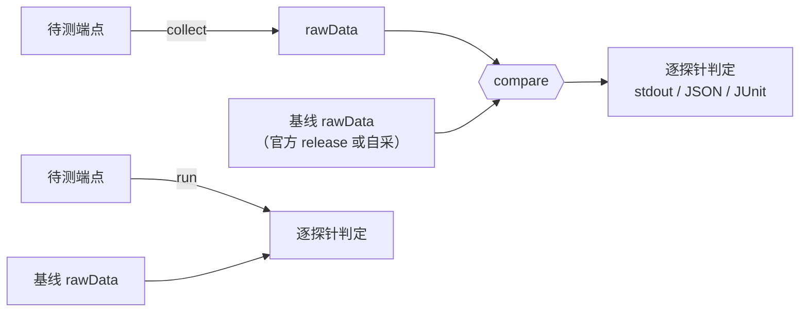
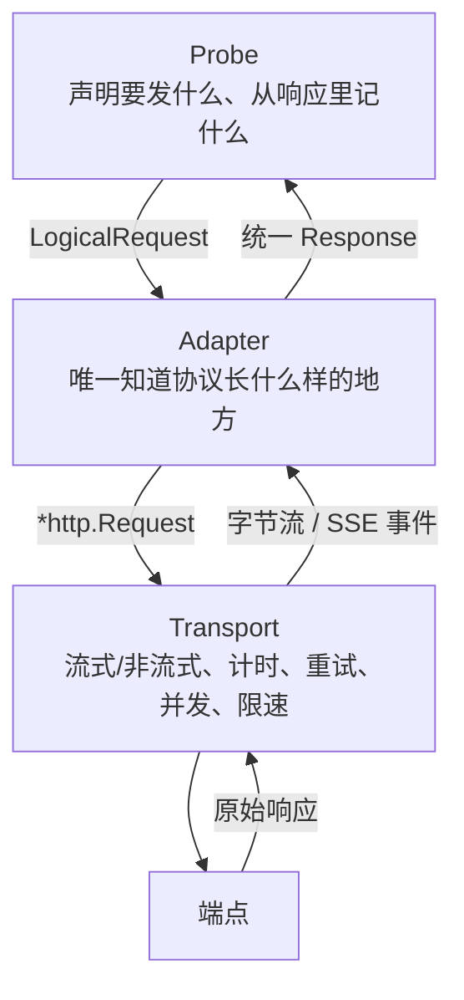

# 架构设计

> 本文是设计定稿，不是实现说明。文中出现的 Go 接口签名用于固定职责边界，
> 不承诺实现时逐字不变。

## 1. 这个工具是什么

Token Verifier 是一个**无状态命令行工具**，用于判断一个 LLM API 端点提供的
是否是它声称的那个模型与那套配置。

它把「模型一致性检测」拆成两件互不依赖的事：

1. **采集**：按一份确定的测试计划访问端点，把观测结果落成一个自包含的证据文件（rawData）。
2. **比较**：读两个 rawData，逐探针给出判定。这一步不发任何网络请求。

拆开的直接好处是官方基线与用户实测走完全相同的代码路径：官方发布某模型的
rawData，用的就是用户手里那条 `collect` 命令。

### 明确不做的事

| 不做 | 原因 |
| :--- | :--- |
| 能力基准评测（推理/编码/多语言/多模态得分） | 那是 benchmark，与「是不是同一个模型」无关 |
| 聚合纯净度分（0-100 单一标量） | 当前阶段不做，见 §7 |
| 提供默认阈值 | 阈值取决于模型、场景与容忍度，只能由使用者标定，见 §6 |
| 存储、服务、Web UI、TUI | 无状态 CLI，输出只有 stdout / JSON / JUnit |
| 断言端点底层的真实模型身份 | 黑盒观测只能给出差异证据，不能给出身份证明 |

## 2. 三种模式



| 模式 | 输入 | 输出 | 是否联网 |
| :--- | :--- | :--- | :--- |
| `collect` | 1 个端点 | rawData | 是 |
| `compare` | 2 个 rawData | 判定 | 否 |
| `run` | 1 个端点 + 1 个基线 rawData | 判定（并可同时落 rawData） | 是 |

`run` 在实现上严格等于 `collect` 后接 `compare`，不存在第二条代码路径。

**因此 CLI 永远只接受至多一个活端点。** 要对比两个活端点，就跑两次 `collect`
再 `compare`。这不是限制，而是让「官方发布基线」与「用户自建基线」成为同一件事。

## 3. 分层



四层的划分只有一条原则：**探针不许自己发请求。**

探针只产出「逻辑请求」的描述，由协调器统一执行。这样并发、限速、重试、SSE
解析、计时全部只有一份实现，所有探针的传输指标口径必然一致；反过来，任何探针
都无法因为自己实现了一遍 HTTP 而让 TTFT 的定义悄悄漂移。

### Probe

```go
type Probe interface {
    Meta() ProbeMeta
    Requests(ProbeConfig, Allocation) []RequestSpec
    Observe(RequestSpec, Response) (Observation, error)
    Compare(a, b []Observation, threshold float64) (Verdict, error)
}

type ProbeMeta struct {
    ID       string
    Version  string       // 语义变更必须递增，见下
    CellKey  []string     // 默认 {question_id, context_bucket}
    Requires Capabilities // 声明能力不满足时，分配阶段不生成该探针的请求
}
```

`Requests` 只描述不执行；`Observe` 在**采集阶段**就把原始响应压成结论性的
观测值；`Compare` 对两侧观测做统计。

**`Observe` 前移到采集阶段是一个有意的设计决定**，它换来三件事：

1. rawData 可以脱敏发布（丢掉原文）而统计仍然算得出来。
2. 匹配逻辑的错误在采集期就暴露，而不是在半年后比较历史数据时才发现。
   参考项目里有过一次真实事故：长上下文埋点探针的匹配是大小写敏感的，而答案
   归一化会小写化，于是命中率恒为 0、p 值恒为 1、判定恒为 pass —— 一个永远
   报「正常」的检测项。把匹配放进 `Observe` 并要求它产出 `matched` 布尔值，
   这类错误会在第一次采集时就显形。
3. 匹配语义一旦改变，`probe_version` 必须递增，从而改变 digest，旧 rawData
   自动变为不可比。语义漂移不可能静默发生。

### Adapter

```go
type Adapter interface {
    ID() string
    Render(LogicalRequest, ThinkingBlock) (*http.Request, error)
    ParseOnce(*http.Response) (Response, error)
    ParseStream(*http.Response, func(Chunk)) (Response, error)
}
```

Adapter 是**唯一**知道 `messages` 数组长什么样、system prompt 放哪、
usage 字段叫什么的地方。目标协议：

- `openai-chat` — Chat Completions 风格
- `openai-responses` — Responses 风格
- `anthropic-messages` — Messages 风格

统一 `Response` 结构，屏蔽各家差异：

```go
type Response struct {
    Content          string
    ReasoningContent string
    ToolCalls        []ToolCall
    Usage            Usage   // Prompt / Completion / Reasoning / Cached
    FinishReason     string
}
```

各协议的 usage 字段名不同（例如输入 token 在不同协议里叫 `prompt_tokens`
或 `input_tokens`），归一在 Adapter 内完成，探针只看 `Usage.Prompt`。

### Transport

一个 worker 池消费单一请求队列。负责：并发上限、请求间隔、重试与退避、
超时、SSE 逐 chunk 计时。

此外做**拥塞控制**：从低并发起步逐步上调，遇到限流（429）、超时或连接错误
信号时回退，以此探测端点实际能承受的并发上限。这条曲线只影响传输指标，
不影响身份统计 —— 每个 cell 的样本数由配置决定，与并发如何变化无关 ——
所以拥塞控制的参数不进 digest。

**每次尝试都是一条独立记录**（`attempt` 字段），不覆盖前次。否则重试会把
错误率洗白 —— 一个每次都要重试两回才成功的端点，和一个一次就成功的端点，
在报告里必须看得出区别。

## 4. 五个探针

这五个探针都支持任意指定上下文下的探查，比如用户可以设置在0,32k,256k三个上下文长度下，执行onetoken、tokenizer、think-effort探针；在512k上下文下执行needle探针；在0上下文长度下进行toolcall探针

| 探针 | 观测什么 | 统计量 |
| :--- | :--- | :--- |
| `onetoken` | 极短答案的取值分布 | 分布间 Jensen–Shannon 散度 |
| `tokenizer` | 服务端上报的输入 token 数 | 逐题整数相等性 → 列联表卡方 |
| `needle` | 长上下文中埋入标记的召回 | 埋点粒度 2×2 卡方 |
| `think-effort` | 思考 token 数的分布 | 逐 cell Mann-Whitney U + Fisher 合并 |
| `toolcall` | 工具选择与参数合法性 | 选择分布 JSD + 合法率卡方，任一分量超阈即 fail |

### onetoken

要求模型输出一个极短的、取值空间有限的答案（一个数字、一个字母、一个颜色词），
温度设为 1.0，同一题重复多次，得到一个取值分布。同一模型的分布高度稳定，
换模型或换量化则分布形状改变。比较两侧分布的 JSD，值域 [0,1]。

温度 1.0 是有意的：温度 0 的贪心解码会把分布压成一个点，反而丢掉了
「采样分布形状」这个信息量最大的特征。

> 参考实现里另有一条温度 0 的贪心路径，本工具**不予保留**。

### tokenizer

只看服务端在 usage 里上报的输入 token 数，不在本地做分词。构造对分词器敏感的
输入（中日韩文字、emoji、全角字符、代码、JSON），逐题比对两侧的整数是否相等。

这个探针不需要任何本地分词器依赖，却能直接反映服务端实际使用的分词器 —— 换了
模型家族、改了 tokenizer 配置、或在前面插了一层改写 prompt 的中间层，都会
在这里露出来。

### needle

在上下文中不同位置埋入一个或多个确定性生成的标记，要求模型读出它。标记由
(题目 ID, 位置序号) 经哈希派生，因此不需要随明文分发；埋入位置由题目
`needle_positions` 显式声明，一题可埋多点，一个埋点即一个统计单元。

比较两侧的召回率：埋点单元在其 cell 内全部 repeats 命中才算「命中」，
命中/未命中的单元数进 2×2 列联表卡方。两侧都不假定全中。

### think-effort

在题目上标注思考强度级别，观测思考量的分布。用于发现「声称开启思考但实际未
开启」或「思考预算被中间层削减」这类降级。逐 cell（题目 × 档位 × 强度级别 ×
协议）做 Mann-Whitney U 检验，Fisher 合并为探针级 p 值。观测单位由协议静态
决定（`adapter.ReasoningUnit`）：openai 两协议取 usage 上报的思考 token 数，
anthropic-messages 无该字段、取交付的思考文本 rune 数；按协议分层保证同一
cell 内单位一致（秩检验的前提）。

### toolcall

给定工具集合与需要用工具的问题，观测：选了哪个工具（分布，逐 cell JSD）、
参数是否语法合法（工具名已知且参数是合法 JSON object；合法率，池化 2×2 卡方）、
是否发起并行调用（进报告明细，不参与判定）。

## 5. 三条配置轴与 cell

### 协议、传输、思考都是配置，不是探针

用户声明自己的端点该怎么被测。三条轴嵌套：**每个协议下各自有传输比例和思考
配置**，因为传输行为与思考字段名本身就是协议特有的。

```yaml
protocols:
  - id: openai-chat
    weight: 0.6
    transport: { stream: 0.5, non_stream: 0.5 }
    thinking: { ... }
  - id: anthropic-messages
    weight: 0.4
    transport: { stream: 1.0, non_stream: 0.0 }
    thinking: { ... }
```

完整 schema 见 [SPEC-CONFIG.md](./SPEC-CONFIG.md)。

**比例是切分 `repeats`，不是相乘。** `repeats: 20` 配上 0.6/0.4 就是 12 + 8，
总请求数仍是 20。混合不放大预算，pooled 后的样本量也不变 —— 这一点很关键，
因为 JSD 的逐 cell 计算有最小样本量门槛，若混合会除薄样本，探针就会静默失效。

**混合比例与思考配置都不进 digest。** 整个 `target` 段是「往哪个网关、用什么
拼写把实验发出去」的接线细节，digest 只锁实验设计、不锁网关接线。混合比例是
使用者自己的测试杠杆：想验证「不同请求格式下模型行为是否一致」就按比例混合，
不想验证就用单一格式。解析后的整数分配表记录在 manifest 的 `sampling` 段供复现
与归因，但两侧混合方式不同不会导致拒绝 —— 比较阶段只输出一条 NOTE 提示。
理由与前提见 [SPEC-RAWDATA.md](./SPEC-RAWDATA.md) §3。

分配完成后用固定种子洗牌决定这 20 次请求的先后顺序，打散协议与传输在时间上的
聚集。否则「先跑完所有流式再跑非流式」会让服务端负载随时间的漂移伪装成协议差异。

### 思考强度的解耦

工具**不认识**任何厂商的思考字段名，也不应该认识 —— 那是一个每季度都在变的
移动目标。机制是这样：

- **题目侧**只写符号级别：`low` / `medium` / `high` / 或 `null`（不开思考）。
- **协议侧**用 `effort_map` 把符号映射成该协议的具体值，再用 `body_overrides`
  把它放到正确的字段位置，位置用 `${thinking_effort}` 占位符标出。

```yaml
thinking:
  disabled:
    body_overrides: { <关闭思考所需的字段> }
  enabled:
    effort_map: { low: <值>, medium: <值>, high: <值> }
    body_overrides: { <字段路径>: "${thinking_effort}" }
```

于是题库完全协议无关，新增一个协议只需加一段配置，不动任何题目、不改任何代码。
正因为档位语义落在题目上（随题库进 digest），`effort_map` 这个「档位 → 网关拼写」
的翻译就是纯接线，不进 digest —— 同一套实验在不同网关上用不同的 effort_map 仍然可比。

占位符有一条**类型保留**规则：当字段值恰好等于 `"${thinking_effort}"` 时，整体
替换为映射值并保留其 JSON 类型 —— 映射到整数就是整数，不会变成字符串。这条必须
写死，因为有协议的思考预算字段是整数类型，塞进字符串会被端点以 400 拒绝。
细则见 SPEC-CONFIG.md。

### cell 与 pooling

```
cell = (probe_id, question_id, context_bucket)     ← 默认，协议与传输 pooled
```

默认把一个题目在各协议、各传输模式下的所有请求**汇入同一个 cell**。这正是
「按真实流量比例采样端点整体行为」的语义：用户实际就是混着用的，那么指纹也
应该是混合流量下的指纹。

`protocol` 与 `transport_mode` 仍然逐条记在每个 record 上，所以分层统计与
派生视图不丢失 —— 想看流式与非流式是否一致、跨协议是否一致，直接在同一份
rawData 内按字段切片即可，**不需要为此设专门的探针**。

**一个例外：`tokenizer` 必须按协议分层。** 不同协议的消息封装本身就导致输入
token 数不同，pooling 会把协议差异和模型差异混成一团，直接毁掉信号。所以探针
可以在 `Meta().CellKey` 里追加 `protocol`。该探针每题只需 1 次请求，分层的
代价可忽略。这是唯一需要分层的探针。

### 上下文档位是通用轴，不是探针

任何探针都可以在多个上下文长度档位下跑。参考实现里把「分档位跑 onetoken」
单列成了一个独立层，这在本工具里自然消解：`context_bucket` 是所有探针共享的
一个轴，写在 cell key 里。

这是这次能力外推中最实质的一处简化 —— 少一个概念，多一个正交维度。

## 6. 阈值

**阈值一律由使用者提供，工具不带任何默认值。** 缺少任一待比较探针的阈值即
拒绝执行并退出（`exit 2`），指名缺哪个。设置方式：命令行 `--threshold` 或
配置文件 `thresholds` 段，命令行优先。报告的每个探针行都印出实际取值与来源
（`config` / `flag`）。

理由：一个阈值意味着「多大的差异算异常」，它取决于模型本身的随机性、部署环境、
以及使用者的容忍度。给一个看起来合理的默认值，等于替使用者做了一个他不知道
自己在做的判断。文档会给一张标定起点表，明确标注为经验值而非默认值。

**阈值不进 digest，也不写进 rawData。** 它是比较时的判据，不是采集参数。这一点
让「阈值可由用户随意调整」和「任何采集计划差异一律拒绝」两条规则不互相矛盾：
用户改阈值不影响与官方 rawData 的可比性，改采集参数才影响。

## 7. 为什么现在不出聚合纯净度分

把 N 个探针的判定压成一个 0-100 的标量，需要回答两个问题：各探针权重怎么定，
以及「差异多大算掉多少分」的曲线怎么定。这两个都需要标定数据支撑 —— 需要知道
同一模型的正常波动有多大，才能说某个差异是否显著。

单 run 的 rawData 没有这个信息。参考实现能给出纯净度分，是因为它有跨 run 的
历史序列，可以用「历史彼此之间的距离分布」当尺子，判断当前这次是否跑出了自洽
范围；而且那条时序轴的权重比静态越限的权重更高。无状态 CLI 拿不到历史，硬套
公式就是给一个没标定过的数字背书。

所以当前阶段只出逐探针证据与判定：统计量、阈值、判定、逐 cell 明细。

**但预留了接缝，成本为零**：每个 `Verdict` 里存 `ratio`，即观测值与阈值的比率
（分布距离类是 `观测/阈值`，卡方类是 `alpha/p`）。这个量的语义是「越限倍数」，
`ratio > 1` 恰好等价于判定 fail。将来要接聚合层，直接消费 `ratio` 即可，不必
重跑任何采集。

## 8. 仓库结构（规划）

```text
cmd/tv/                  CLI 入口：collect / compare / run
internal/config/         配置加载、校验、比例分配
internal/plan/           CollectionPlan 构建与 digest 计算
internal/suite/          题库加载与校验（外部 YAML 文件，见 SPEC-SUITE.md）
internal/adapter/        协议适配器，每协议一个包
internal/transport/      HTTP、SSE、重试、并发、计时
internal/probe/          探针实现与注册表，每探针一个包
internal/rawdata/        rawData 读写（NDJSON + gzip）
internal/stats/          统计原语：JSD、卡方、列联表
internal/compare/        配对、digest 闸门、判定汇总
internal/report/         stdout / JSON / JUnit 输出
```

依赖目标：`gopkg.in/yaml.v3` 之外全部使用 Go 标准库。gzip、JSON、HTTP、
SHA-256 标准库都有，无需引入。单一静态二进制，交叉编译覆盖
linux / darwin / windows。

## 9. 相关文档

- [DATAFLOW.md](./DATAFLOW.md) — 数据流、请求生命周期、digest 闸门与拒绝路径
- [SPEC-CONFIG.md](./SPEC-CONFIG.md) — 配置 schema、分配算法、校验规则
- [SPEC-RAWDATA.md](./SPEC-RAWDATA.md) — rawData 文件格式与字段定义
