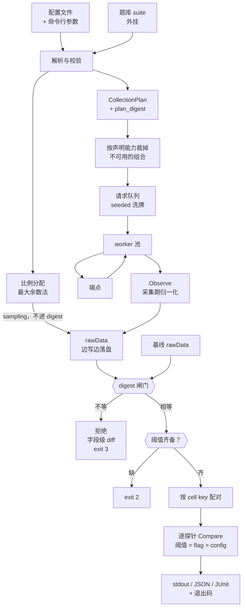
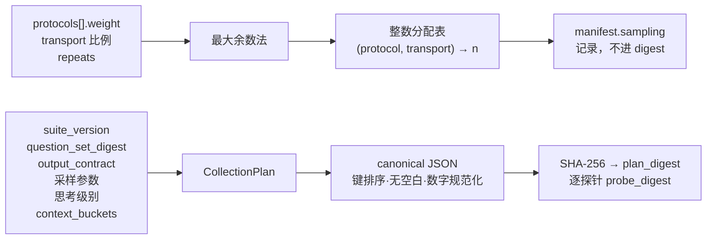
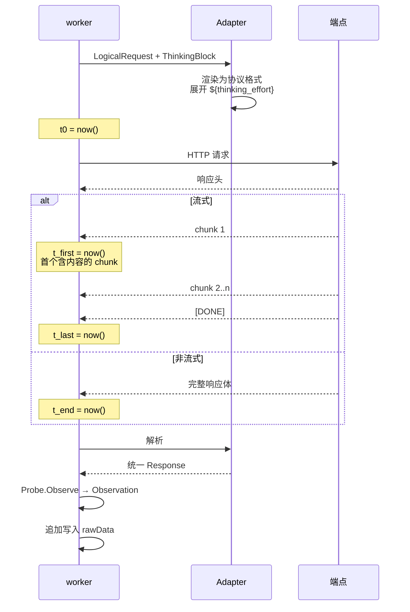
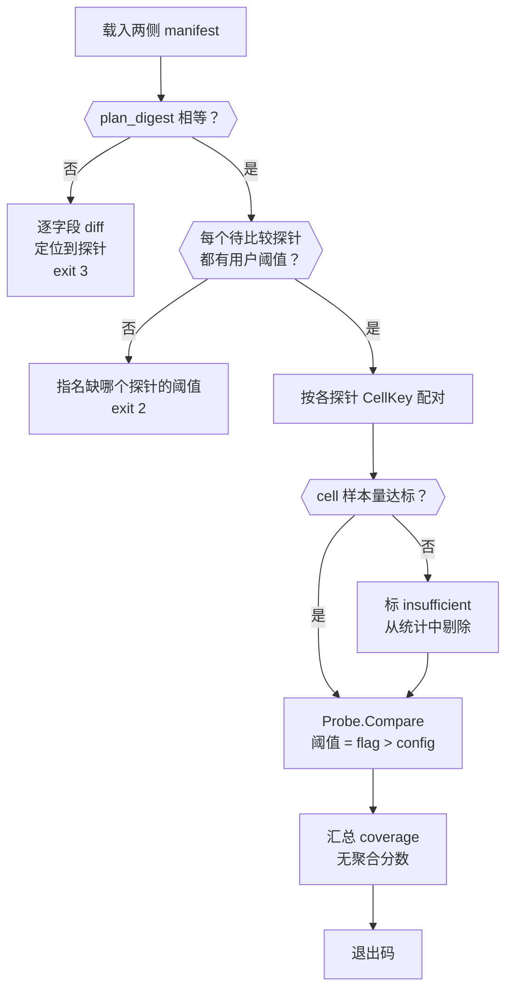
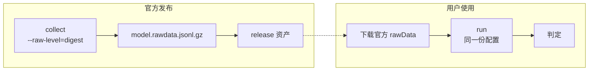

# 数据流

> 配套阅读：[ARCHITECTURE.md](./ARCHITECTURE.md)（分层与探针）、
> [SPEC-CONFIG.md](./SPEC-CONFIG.md)（配置字段）、
> [SPEC-RAWDATA.md](./SPEC-RAWDATA.md)（rawData 字段）

## 1. 全景



采集与比较之间的唯一接口就是 rawData 文件。这条边界让 `compare` 完全离线、
可重放、可在 CI 里对历史文件反复执行。

## 2. 采集阶段

### 2.1 从配置到 CollectionPlan



分配表写入 manifest 的 `sampling` 段，**不进 digest**。比例是使用者自己的测试
杠杆：想验证「不同请求格式下模型行为是否一致」，就按自己选的比例混合；不想
验证，就用单一格式。把它锁进 digest 会剥夺这个杠杆 —— 官方基线用单一格式发布
时，任何想混格式采集的使用者都会立刻变得不可比。

这里有一个明示的前提：**请求格式（协议封装、流式与否）不改变背后模型的指纹。**
该前提若被违反，表现形态是自洽的：混格式采集与官方指纹不符、而单格式采集相符，
使用者由此自然把问题定位到「格式相关」的行为上。比较阶段会对两侧 `sampling`
的差异输出提示性 NOTE（不是拒绝），帮助使用者做这个归因。

`plan_digest` 覆盖全局，`probe_digest` 逐探针，用途是把冲突定位到具体探针
而不是只报一句「整体不匹配」。

### 2.2 比例分配

`repeats` 是一个 cell 的**总请求数**，按权重切分而非相乘：

```
onetoken · question=ot.v1.003 · bucket=0 · repeats=20
├── openai-chat            20 × 0.6 = 12
│   ├── stream             12 × 0.5 = 6
│   └── non_stream         12 × 0.5 = 6
└── anthropic-messages     20 × 0.4 = 8
    ├── stream              8 × 1.0 = 8
    └── non_stream          8 × 0.0 = 0
                                    ─────
                            合计     20
```

两级都用最大余数法取整，保证各档之和恰好等于 `repeats`。算法与边界见
SPEC-CONFIG.md §5。

分配得到的 20 个请求随后用固定种子洗牌，决定实际发出顺序。**洗牌是必要的**：
若按协议顺序串行执行，服务端负载随时间的漂移会被记成协议间差异。洗牌把这种
时间相关的偏差摊平到所有档位上。

### 2.3 能力：声明式，不探测

采集前**完全信任配置文件里声明的能力与协议**，不发任何探测请求。声明写在每个
协议的 `capabilities` 里（stream / tools / thinking / context_window），
原样进入 manifest，但**不参与 digest** —— 它是网关接线细节，裁剪效果体现在
`sampling` / `skipped`，比较时两侧对不上只出 NOTE 不拒绝。

两个使用点：

1. **分配阶段裁掉不可用的组合。** 声明 `tools: false` 的协议不生成 `toolcall`
   的请求；声明 `thinking: false` 的协议不生成需要思考档位的请求
   （`think-effort` 探针与标注了 `thinking_effort` 的题目）；声明窗口小于某
   `context_bucket` 的协议不生成该档位的请求。裁掉的原因写进 manifest。
2. **运行时跳过并记录。** 声明与事实不符时，请求会以能力相关错误失败；受影响的
   (探针, 协议) 组合被跳过，原因与端点原始错误摘要写进 manifest 的 `skipped`。

这些记录本身就是证据：一侧支持工具调用、另一侧不支持，这个事实比任何统计量
都更直接地说明两个端点不是一回事。而「声明错了」也不会静默得出错误结论 ——
失败与跳过都留痕，报告里可见。

### 2.4 请求生命周期与计时点



计时定义：

| 指标 | 定义 | 非流式时 |
| :--- | :--- | :--- |
| `latency_ms` | `t_end - t0`（整体墙钟） | 同 |
| `ttft_ms` | `t_first - t0`，首个**含内容**的 chunk | **留空**，不填 0 |
| `tps` | `completion_tokens / (t_last - t_first)` | **留空** |

`ttft_ms` 在非流式下留空而非填 0，是因为参考实现恰恰把它硬编码成了 0 并一路
透传，导致该字段在整个系统里全程无意义 —— 看起来有数据，实际是占位符。留空
（JSON `null`）能让下游明确区分「测不了」和「测出来是 0」。

`tps` 用 `t_last - t_first` 而非 `t_last - t0`，避免把首字延迟算进吞吐，
否则 TTFT 高的端点会被重复惩罚两次。

### 2.5 重试与错误率

每次尝试写一条独立 record，`attempt` 从 0 递增，**不覆盖前次**。

```
attempt=0  status=error   error_kind=timeout
attempt=1  status=error   error_kind=http_5xx
attempt=2  status=success
```

于是「一次成功」和「重试两次才成功」在数据里可区分。若用覆盖语义，重试会把
错误率洗白到 0，而可用性恰恰是要测的东西之一。

`error_kind` 归类：`timeout` · `connection` · `http_3xx`（重定向；客户端
不跟随 —— 恶意端点可用 3xx 把认证头转发到任意第三方主机）· `http_4xx` ·
`http_5xx` · `protocol`（响应结构不符合协议）· `parse`（SSE 或 JSON 解析
失败，含响应体超过 512KiB 上限）。

### 2.6 落盘与续跑

rawData 边采边追加写。文件本身即是续跑状态：重启时读回已完成的
`(probe_id, question_id, context_bucket, protocol, transport_mode, repeat_index)`
组合，跳过它们。不需要额外的检查点文件或状态数据库。

### 2.7 失败与样本量的处理

**单题最大重试次数**：`runtime.max_attempts`（含首次）。同一 cell 的同一
`repeat_index` 重试到上限仍失败，该次记为失败 record，不再重试。每次尝试都留痕
（§2.5），所以「重试到上限仍失败」在数据里可见。

**样本量不足的 cell**：比较阶段按下限检查每个 cell 的有效样本数，
不达标的整个 cell 标 `insufficient` 并剔除，不会伪装成完整数据参与统计。
下限即 `min_n`（配置 `probes.<id>.min_n`，缺省 onetoken 10、tokenizer 1）。
`min_n` 随采集计划进 digest，但它是判据参数（只被比较侧消费）：比较时按
`本地 config > 计划烘焙值 > 缺省` 解析 —— 不带 `-c` 比较时可复现计划里的值，
带 `-c` 时以使用者的判据为准（见 §3.2）。
分布距离类探针对样本量尤其敏感 —— 用几个样本估出的分布形状不足以支撑判定。

工具**不设全局请求数 / token 数 / 时长预算闸门**。总请求量在采集前完全由配置
决定（题数 × 档位数 × 协议数 × 传输数 × repeats），`--dry-run` 会先把这个数
和 token 估算印出来，由使用者自己决定是否执行。预算是配置阶段的责任，不是运行
时的隐式截断 —— 运行时截断会产生一份「不完整但看起来完整」的数据，比超支更糟。

## 3. 比较阶段

### 3.1 闸门顺序



顺序是刻意的：**先验可比性，再验判据齐备，最后才算统计。** 反过来会浪费算力
在注定要被拒绝的数据上，更糟的是可能在报告里先给出一堆统计量、再说这些统计
其实不可比。工具不提供默认阈值，所以「每个待比较探针都有用户阈值」是一道真闸门：
缺一个就 `exit 2` 并指名缺哪个。阈值按 `flag > config` 解析，报告印出每个探针
实际使用的阈值与来源。

### 3.2 digest 闸门：默认任何差异一律拒绝，--allow-subset 按字段调和

默认（严格模式）：`plan_digest` 不等即拒绝，**不做部分比较**。同时输出字段级 diff：

```text
ERROR  incompatible collection plans
  plan_digest  sha256:9f2c1a…  vs  sha256:41ab7e…

  probe onetoken
    repeats                            20        vs  30
    temperature                       1.0        vs  0.7
  probe needle
    context_buckets            [0, 131072]       vs  [0, 262144]
  probe toolcall
    present                           yes        vs  no

3 probes conflict. 两侧必须使用同一 collection plan，本工具不做部分比较。
如确认只需比较两侧计划的交集，可加 --allow-subset（strict 字段仍须一致）。
```

digest 是硬闸，diff 是给人看的定位信息 —— 不是「差异不大就放行」的余地。

设计取向：**宁可拒绝，不做勉强的比较。** 一个带着「其实有几项不太可比」脚注
的判定，在 CI 里会被当成正常结论消费掉，而脚注不会有人读。拒绝会迫使使用者
处理冲突，这正是应该发生的事 —— 怎么处理交给使用者，工具只负责让冲突无法被
忽略。

#### 子集模式（--allow-subset）

`tv compare --allow-subset`（`tv run` 同名 flag）把闸门从「digest 逐字节一致」
放宽为**字段级三分法**，只比较两侧计划可调和的交集：

| 分类 | 字段 | 规则 |
| :--- | :--- | :--- |
| strict | plan 层：`suite_version` / `padding_algo_version` / `padding_seed` / `normalize` / `output_contract`；探针层：`probe_version` / `observation_schema` / `normalize_rule` / `cell_key` / `question_ids` / `temperature` / `top_p` / `max_tokens` / `thinking_effort` | 不等仍拒绝（exit 3）。这些字段决定「观测是什么、怎么配对、请求发的是什么」，放宽等于拿两套实验对比 |
| intersect | `context_buckets` | 按两侧**声明**的档位取交集；单侧独有档位剔除并记录；无交集则该探针整体剔除 |
| relaxed | `repeats` | 取两侧较小值。cell 内按 `repeat_index` 升序截断到 `min(nA, nB)` 降采样对齐 —— JSD 类统计量对两侧样本量不对称敏感（小样本系统性抬高 JSD），降采样让已标定的阈值继续成立；取前 k 个而非随机抽样，保证确定性 |
| relaxed | `min_n` | 闸门忽略。min_n 是判据参数而非采集参数（与 thresholds 同类，只被比较侧消费），比较时按 `本地 config > 计划烘焙值 > DefaultMinN > 探针默认` 解析，报告印出生效值。**该解析规则对严格模式同样生效**：digest 一致时两侧烘焙值必然相同，但带 `-c` 比较时本地 config 的值可覆盖它 —— digest 一致不再蕴含判定参数完全一致，这是与 thresholds 对齐的有意取舍 |

探针集合也按交集：disabled 探针不进计划（`plan.Build` 只遍历 enabled 的），
所以「两侧都存在的探针」天然等价于「两侧都 enabled 的探针」。单侧独有的探针
剔除并记录原因。`format_version` 不等时任何模式都拒绝。

`question_set_digest` 不参与 plan 层 strict 比对：它是派生字段 —— 全部**启用**
探针的 `question_ids` 并集的哈希。两侧启用探针集合不同时（如一侧禁用 needle）
它必然不等，而这正是子集模式要容忍的差异。真实的题库差异由逐探针的
`question_ids` strict 比对拦截：同一探针两侧题目集合不同照样拒绝。
两侧该值不等时输出 NOTE 说明。

子集模式对「缩水的交集被当成完整比较」的防护是三重的，对应上文「脚注没人读」
的失败模式：

1. **显式选择**：默认严格，放宽必须打 flag；
2. **头部强制段落**：stdout 报告顶部印 `SCOPE` 段（两侧 digest、参与比较的
   探针与生效 repeats/min_n、被排除的探针/档位及原因），JSON 报告带
   `subset: true` + `scope` 对象，JUnit 带同名 properties —— 不是脚注，是
   报告的第一行；
3. **独立退出码**：子集比较即使全 pass 也返回 `6` 而非 `0`（见 §3.6），
   CI 无法把它当成完整通过消费。fail（1）与 inconclusive（5）优先级不变。

strict 冲突或交集为空时，子集模式仍走 `report.Reject`（exit 3），措辞标明
「子集模式下以上 strict 字段冲突仍不可调和」。

**digest 计算不受影响**：`plan_digest` 仍是整个 `collection_plan` 的 SHA-256，
已发布的官方基线与旧 rawData 继续有效；`EnsureFile` 的续写守卫也保持严格
（同一文件里混两个 plan 是另一回事，该拒）。

**注意 diff 里不会出现协议与传输的分配差异。** 比例是使用者自己的测试杠杆：
想验证「不同请求格式下模型行为是否一致」，就按自己选的比例混合；不想验证，
就用单一格式。把它锁进 digest 会剥夺这个杠杆 —— 官方基线用单一格式发布时，
任何想混格式采集的使用者都会立刻变得不可比。

这里有一个明示的前提：**请求格式（协议封装、流式与否）不改变背后模型的指纹。**
该前提若被违反，表现形态是自洽的：混格式采集与官方指纹不符、而单格式采集相符，
使用者由此自然把问题定位到「格式相关」的行为上。比较阶段会对两侧 `sampling`
的差异输出提示性 NOTE（不是拒绝），帮助使用者做这个归因。

### 3.3 配对与样本量

按各探针声明的 `CellKey` 分组配对：

- 默认 `{question_id, context_bucket}` —— 协议与传输 pooled
- `tokenizer` 为 `{question_id, context_bucket, protocol}` —— 必须按协议分层，
  因为不同协议的消息封装本身就导致输入 token 数不同
- `think-effort` 为 `{question_id, context_bucket, thinking_effort, protocol}` ——
  按强度分组是语义要求；按协议分层是单位要求：观测单位由协议静态决定
  （openai 系 = usage 上报的思考 token 数，anthropic-messages = 交付的思考文本
  rune 数），秩检验只允许同单位的样本进同一 cell（见 PROBES.md）

只有两侧都存在的 cell 参与统计。任一侧样本量不达下限（`min_n`，解析规则见
§3.2：本地 config > 计划烘焙值 > 缺省）时，整个
cell 标 `insufficient` 并剔除，不参与统计量计算。分布距离类探针对样本量敏感，
用几个样本估出来的分布形状不足以支撑判定。

### 3.4 判定

```go
type Verdict struct {
    ProbeID    string
    Statistic  float64   // 分布距离 或 p 值
    Threshold  float64   // 用户提供
    Ratio      float64   // 见下
    Verdict    string    // pass | fail | inconclusive
    Buckets    []BucketVerdict // 多档位时的逐档位子判定
    Cells      []CellDetail
}
```

`Ratio` 的定义使两类统计量可比：

| 统计量类型 | Ratio | 语义 |
| :--- | :--- | :--- |
| 分布距离（越大越差） | `statistic / threshold` | `> 1` 即越限 |
| p 值（越小越差） | `alpha / p` | `> 1` 即越限 |

两者都满足 `ratio > 1 ⟺ fail`。当前**不消费** `Ratio`，它是给将来的聚合层
预留的接缝：要接聚合，直接读 `ratio` 即可，无需重跑采集。

**按档位分区判定。** 探针声明了多个 `context_buckets` 时，cell 先按
`context_bucket` 分区，每档位用各自生效的阈值（`thresholds.<probe>.<bucket>`
覆盖探针级兜底）独立判定，得到档位子判定 `BucketVerdict`；探针级 `Verdict`
是 rollup：`Statistic` / `Threshold` / `Ratio` 取最差档位（ratio 最大者）的值，
`Cells` 拼接各档位。某档位 inconclusive（样本不足等）时排除该档位、
在 `Warning` 里点名，全部档位 inconclusive 才整体 inconclusive。
报告层把子判定展开：stdout 档位子行、JSON `buckets` 数组、JUnit 每档位一个
testcase（`onetoken[context_bucket=8000]`）。单档位探针不分区、无子判定，
行为与分区机制引入前一致。

`inconclusive` 用于：探针因缺能力被跳过、所有 cell（或所有档位）都 insufficient、
或该探针只在一侧存在（后者通常已在 digest 闸门被拦下）。

### 3.5 传输指标不参与判定

可用性、错误率、超时率、TTFT、TPS、整体延迟与吞吐都会逐条采集、分层汇总、
并在报告里作**描述性对比**输出，但**默认不参与 pass/fail**。

原因：这些量主要反映网络路径与瞬时负载，而非模型身份。把它们算进判定会在
跨地域、跨时段比较时制造大量假阳性 —— 一个真实的同模型端点，只因为机房不同
就被判为不一致。

要对它们设门限，需要使用者显式提供阈值，与探针阈值同一套机制。

分位数（p50/p90/p99）之外，比较结果还携带 latency/ttft/tps 的**两侧联合
直方图**（共享分箱边界，counts 逐 bin 对齐），`-v` 时在 stdout 渲染为
ASCII 条形对比，`--json` 里是 `transport_histograms` 段 —— p50 相同的
两侧，分布形状可能完全不同，直方图让这种差异可见。同样只是描述性证据。

架构图上传输指标与身份探针常被画在同一层，容易被读成同等强度的证据。它们
不是：身份探针回答「是不是同一个模型」，传输指标回答「这条链路当时快不快」。

### 3.6 汇总与退出码

不产出聚合分数。汇总只有一个覆盖率：

```
coverage = 实际比较的探针数 / 计划比较的探针数
```

| 退出码 | 含义 |
| :--- | :--- |
| `0` | 全部探针 pass |
| `1` | 至少一个探针 fail |
| `2` | 用法错误、配置非法、缺阈值 |
| `3` | 采集计划不兼容，拒绝比较（含 --allow-subset 下的 strict 冲突与空交集） |
| `4` | 采集阶段致命错误：端点完全不可达（全部请求连接失败、从未收到任何 HTTP 响应）、输出文件不可写、或续跑时 plan_digest 与文件不一致被拒绝 |
| `5` | 无 fail，但存在 inconclusive 探针（被跳过或全部 cell 样本不足） |
| `6` | 子集比较（--allow-subset）无 fail 也无 inconclusive：结论只覆盖两侧计划的交集，不是完整通过 |

`4` 的边界刻意收窄：个别请求失败（重试到上限）只是 error record，正常落盘、由
比较阶段按样本不足处理；端点可达但全部返回 4xx/5xx 同样不是致命错误 —— 那是
「端点在拒绝服务」这一事实本身，应该被记录进 rawData 而不是中断采集。只有
「一个成功样本都没有且从未收到任何响应」才意味着采集无法产出任何可用数据。

`3` 与 `1` 分开是关键：CI 里「测出了差异」和「根本没法比」需要触发不同的处理，
前者该报警，后者该修配置。`5` 对 `0` 的理由同构：exit 0 的语义是「全部探针
pass」，一份带 inconclusive 的结果若也返回 0，会在 CI 里被当成正常结论消费掉
—— 正是 §3.2 批评过的「脚注没人读」失败模式。`6` 对 `0` 的理由再次同构：
子集比较的「全 pass」只覆盖交集，范围缩水不该以 exit 0 的形态溜进 CI。
fail 优先于 inconclusive：只要有探针 fail，退出码就是 `1`。

## 4. 官方基线与用户实测的同构性



官方发布基线用的就是用户手里的 `collect`，没有特权路径。用户想自建基线，
或对比两家供应商，做法完全一样：各跑一次 `collect`，再 `compare`。

配置必须一致这件事由 digest 闸门保证 —— 官方 rawData 的 manifest 里带着完整
的 CollectionPlan，用户用不同配置采集出来的数据一比就会被拒绝，并明确指出
哪个字段不同。
